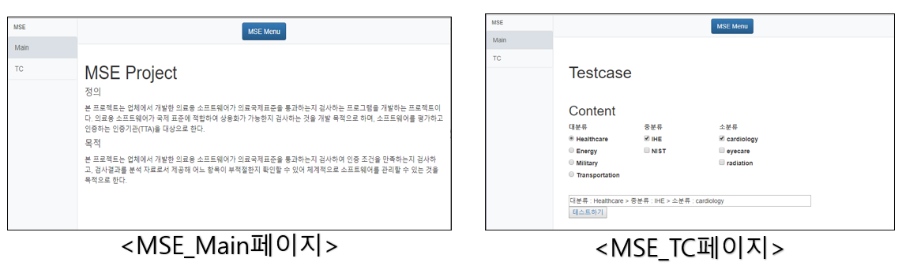
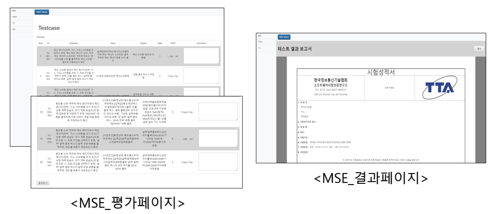

# SW_Quality_Evaluation_System
> 학부생 3학년 2학기 때 개발한 의료표준을 이용한 소프트웨어 품질평가 시스템

## 개발기간
* 2019.09.03.~12.01. (약3개월)

## 주요 기능
* QA가 편리하게 SW를 평가할 수 있도록 국제표준(IHE,ISO9126) 기반의 의료용 SW 품질평가시스템 
* 국제표준에 기술된 테스트케이스들을 DB화하여 사용자가 체크함으로써 SW의 품질을 평가하도록 함
    * 도메인 지정 -> 테스트케이스 선택 -> 결과보고서 생성

## 담당한 부분
* CM(형상관리)
    * 문서 템플릿 생성
    * 문서 및 산출물 버전 관리
	 * 회의록 작성
 * DB 관리 

## Development setup
* 사용된 언어 : HTML/CSS/JS
* 웹 서버 : AWS EC2 (Ubuntu, Apache Tomcat)
* DB 서버 : AWS RDS (MySQL)

## Release History

* 1.0.0
    * first
    * 개발 완료

## Contact

김준혁 – kimjunhyeok.it@gmail.com
